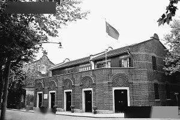
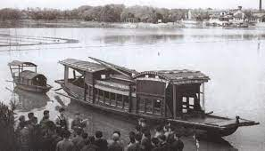

import { CodeWave } from 'gatsby-theme-waves';
import ImageWave from '../../src/components/image-wave';

<ImageWave>

1921 年 7 月 23 日，中国共产党第一次全国代表大会在上海召开。由于会场受到法租界巡捕的搜查，最后一天的会议转移到浙江嘉兴南湖的游船上举行~

1921 年 8 月 3 日黄昏，浙江嘉兴南湖的暑热逐渐散去。湖面上一艘中等大小的画舫内，气氛庄重肃穆。在“中国共产党万岁”的低声呼喊中，中国共产党第一次全国代表大会闭幕

2021 年是中国共产党百年华诞。中国站在“两个一百年”的历史交汇点，全面建设社会主义现代化国家新征程即将开启。世界将更多目光投向中国，聚焦中国共产党矢志不渝为人民谋幸福，为民族谋复兴，为世界谋大同。

</ImageWave>
