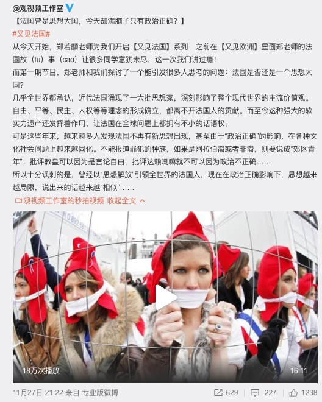

import { CodeWave } from 'gatsby-theme-waves';
import ImageWave from '../../src/components/image-wave';

<ImageWave>

在国家和社会层面警惕政治正确思想很重要，但对于我们个人来说，警惕个人内心的所谓政治正确的限制更为重要。即警惕“只有我接受和喜欢的才是好的”这种思想。在博物馆里逛上一整天和用手机刷一天快手抖音并没有什么不同，藏品文物蕴含久远深意和魅力，快抖的小姐姐向外透着年轻的创意和生命力。思想深远视野开阔纵然重要，活得简单吃饱就睡也不是不可，这不是佛系，更不是圣母，而是要能欣赏世间一切的美好。

罗大佑在演唱会时说过，如果他年轻时活在现在这个时代，也会和现在的年轻人一样，每天发发自拍。深以为然

</ImageWave>
